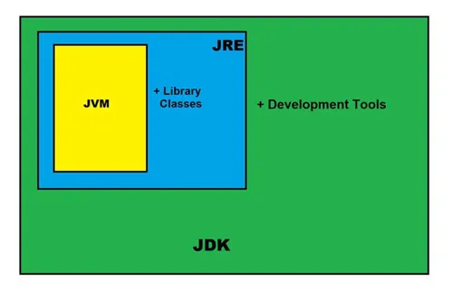
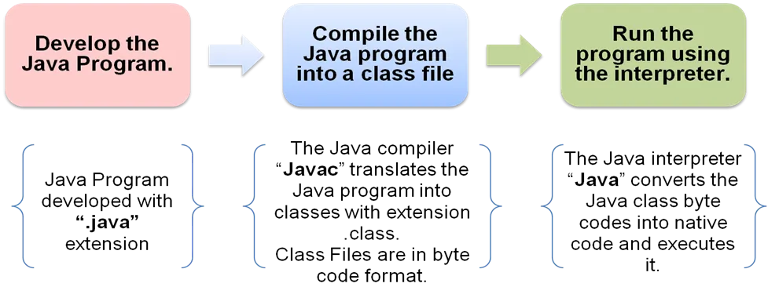

# 📝 Introduction to OOP

---

## ✅ Subtopic 1: What is Programming? + Programming Paradigms (Imperative & Declarative)

## 🧠 What is Programming?

### 🌟 Simple Explanation

**Programming** is like giving instructions to a computer to make it do what **you** want. Think of it like following a recipe to bake a cake!

Imagine a computer as a **robot** that doesn't understand anything until you **teach** it step-by-step using a programming language (e.g., **Java**).

### 💡 Example

> Let's say you want the computer to add 2 numbers.
> You can write a program that tells the computer:
>
> "Take number 5 and number 3, and show me the result after adding them."
>
> That’s programming!

---

## 🧭 What is a Programming Paradigm?

A **programming paradigm** is a way or a style of writing and organizing code. It's like choosing how to build a LEGO house – there are different approaches!

Two big types are:

### 🔹 1. Imperative Programming

#### 📘 Meaning:

Tells the computer **how** to do something, step by step.

#### 🛠️ Think of it as:

Writing instructions like:

- "Do this"
- "Then do this next"
- "Then that..."

#### ✅ Example (in simple terms):

```java
int a = 5;
int b = 3;
int sum = a + b;
System.out.println(sum);
// Here, we explicitly told the computer how to get the result.
```

### 🔹 2. Declarative Programming

#### 📘 Meaning:

Tells the computer **what result you want**, not how to do it.

#### 🛠️ Think of it as:

Telling the computer:

"I want the sum of these numbers" — and it figures out the steps itself.

#### ✅ Example:

In database (like SQL):

```sql
SELECT name FROM students WHERE grade > 80;
```

Here we’re saying **what** we want (names of students with grade \> 80), not **how** to get it.

---

### 🔄 Summary Table

| Feature                  | Imperative Programming | Declarative Programming   |
| :----------------------- | :--------------------- | :------------------------ |
| **Focus**                | How to do it           | What to do                |
| **Examples**             | Java, C, Python        | SQL, HTML, Prolog         |
| **Control flow needed?** | Yes                    | Usually No                |
| **More readable for?**   | Beginners              | Experts / Domain-specific |

---

**📌 Important Note:** In Java, we mostly use an imperative programming style, especially when learning.

---

## ✅ Subtopic 2: What is Object-Oriented Programming (OOP)?

## 🧠 What is Object-Oriented Programming (OOP)?

### 🌟 Simple Explanation

OOP stands for **Object-Oriented Programming**. It’s a way of writing code where we **think like real life**.

Instead of just giving instructions, we create **objects** — like a **car**, a **dog**, or a **student** — and tell them what to do.

These objects are made from **classes**, which are like **blueprints**.

---

## 👀 Real Life Example

Let’s say we want to create a game with animals:

- Every animal has a **name**, **sound**, and **legs**.
- Each animal can **speak()**, **run()**, or **eat()**.

With OOP, we can create a **class Animal**, and then create many **objects** like Dog, Cat, etc., from it!

---

## 🎓 OOP Terminology

| Term          | Meaning                                                    |
| :------------ | :--------------------------------------------------------- |
| **Class**     | A **blueprint** or template (e.g., `Animal`)               |
| **Object**    | A **real thing** created from a class (e.g., `Dog`, `Cat`) |
| **Method**    | An **action** or behavior (e.g., `speak()`, `run()`)       |
| **Attribute** | A **property** or data (e.g., `name`, `color`)             |

---

## ✨ Why use OOP?

- ✅ Easy to understand and design
- 🔁 Code reusability using classes and objects
- 🔒 Better security (we hide unnecessary data)
- 🔄 Easy to modify and extend code

---

## 🧱 OOP vs Procedural Programming

| Feature                | Procedural Programming | Object-Oriented Programming  |
| :--------------------- | :--------------------- | :--------------------------- |
| **Focus**              | Functions / Procedures | Objects and Classes          |
| **Code reuse**         | Hard                   | Easy (via inheritance, etc.) |
| **Example Language**   | C                      | Java, Python, C++            |
| **Data and Functions** | Separate               | Combined together in objects |

---

## 🛠️ A Simple OOP Example in Java

```java
class Dog {
    String name = "Buddy"; // Attribute

    void bark() { // Method
        System.out.println(name + " says: Woof!");
    }
}

public class Main {
    public static void main(String[] args) {
        Dog myDog = new Dog();  // Creating object
        myDog.bark();           // Calling method
    }
}
```

---

### 📌 Recap:

- OOP is a way to think in objects.
- We use classes to create objects.
- Objects have properties (data) and methods (actions).

---

## ✅ Subtopic 3: Object-Oriented Languages – C++, Python, Java (with Importance of Java)

## 💡 What are Object-Oriented Languages?

These are programming languages that follow the **OOP principles** – like **creating classes**, **objects**, **encapsulation**, **inheritance**, and more.

They allow us to write **real-world-style code**, making it easier to understand and maintain.

---

## 🐱‍🏍 Top Object-Oriented Languages

### 1. 🧱 C++

- One of the first OOP languages.
- Supports both **procedural** and **object-oriented** programming.
- Great for **system programming**, **games**, **embedded systems**.
- Uses **pointers**, **manual memory management**, and **multiple inheritance**.

🛠️ Sample:

```cpp
class Student {
public:
    void sayHi() {
        cout << "Hi from C++!";
    }
};
```

### 2\. 🐍 Python

- Very beginner-friendly.
- Dynamically typed and high-level.
- Used in data science, web dev, AI, automation.
- Clean and readable syntax.

🛠️ Sample:

```python
class Student:
    def say_hi(self):
        print("Hi from Python!")
```

### 3\. ☕ Java (Most Widely Used)

- Pure Object-Oriented Language (almost everything is in a class).
- Platform-independent: Write Once, Run Anywhere.
- Used in Android apps, enterprise systems, backend APIs, banking apps, etc.
- Has strong community support, frameworks (like Spring, Hibernate, etc.), and tools.

🛠️ Sample:

```java
class Student {
    void sayHi() {
        System.out.println("Hi from Java!");
    }
}
```

---

### ⭐ Why Java is So Important?

| Feature                              | Why It Matters                                |
| :----------------------------------- | :-------------------------------------------- |
| **🔁 Platform Independent**          | Java runs on any OS using JVM                 |
| **🧱 Object-Oriented**               | Helps model real-world problems efficiently   |
| **🌐 Used in Enterprise & Web Apps** | Big companies trust Java for scalable systems |
| **📱 Android Development**           | All Android apps are built using Java/Kotlin  |
| **🔒 Secure**                        | Java has a built-in security model            |
| **🧰 Robust Tools & Libraries**      | Has powerful tools like Eclipse, IntelliJ     |

---

### 🆚 Comparing the Three OOP Languages

| Feature               | C++            | Python            | Java                 |
| :-------------------- | :------------- | :---------------- | :------------------- |
| **Compilation**       | Compiled       | Interpreted       | Compiled to bytecode |
| **Syntax**            | Complex        | Simple            | Medium               |
| **Memory Management** | Manual         | Automatic (GC)    | Automatic (GC)       |
| **Speed**             | Fastest        | Slower            | Medium               |
| **Used In**           | Games, Systems | AI, ML, Scripting | Web, Android, APIs   |

---

### 📌 Recap:

- C++, Python, and Java are top OOP languages.
- C++ is close to hardware.
- Python is great for scripting and AI.
- Java is perfect for large, reliable, cross-platform applications.

---

## ✅ Subtopic 4: History and Editions of Java

## 🕰️ History of Java

| Year  | Event                                                                                          |
| :---- | :--------------------------------------------------------------------------------------------- |
| 1991  | Java began as a project called **"Green"** at Sun Microsystems.                                |
| 1995  | Officially launched as **Java 1.0**. It promised **"Write Once, Run Anywhere"** using the JVM. |
| 2006  | Java was made **open-source** under the GPL license.                                           |
| 2010  | **Oracle Corporation** acquired Sun Microsystems and took over Java.                           |
| 2017+ | Java adopted a **new release cycle** — a new version every **6 months**.                       |

---

## 🧑‍💻 Creators of Java

- **James Gosling** – also called the “**Father of Java**”
- Team at **Sun Microsystems**

---

## 💬 Why Java Was Created?

Java was designed to be:

- **Simple**: Easy to learn and write.
- **Object-Oriented**: Based on real-world modeling.
- **Secure**: Designed to run safely on networks.
- **Portable**: Runs on any device with JVM.
- **Robust**: Strong memory management and error handling.

---

## 🧱 Editions of Java

Java has different versions (called **editions**) for different types of users and applications:

### 1. 🖥️ Java SE (Standard Edition)

- Core Java.
- Includes basic libraries like:
  - **java.lang**
  - **java.util**
  - **java.io**
- Used for desktop and console-based applications.

📌 Used in:

- Learning Java
- Building utilities and tools

---

### 2. 🌐 Java EE (Enterprise Edition)

- Built on top of Java SE.
- Adds APIs for:
  - **Web Services**
  - **Servlets**
  - **JSP**
  - **Enterprise JavaBeans (EJB)**
  - **Database Connectivity**

📌 Used in:

- Web apps
- Banking systems
- Large enterprise systems

📝 Note: Java EE is now known as **Jakarta EE**.

---

### 3. 📱 Java ME (Micro Edition)

- Lightweight version of Java for **mobile devices**, **smartcards**, **embedded systems**.
- Smaller memory footprint.

📌 Used in:

- Old mobile games
- IoT devices

---

### 4. ⚙️ JavaFX

- Rich GUI toolkit to build **modern desktop applications**.
- Replaced older **Swing** and **AWT**.

📌 Used in:

- Desktop apps with animations, charts, UI controls

---

## 📌 Summary Table

| Edition | Purpose                      | Example Applications          |
| :------ | :--------------------------- | :---------------------------- |
| Java SE | Core programming             | Desktop tools, Java basics    |
| Java EE | Enterprise-level development | Web apps, large business apps |
| Java ME | Embedded & mobile systems    | Old games, IoT devices        |
| JavaFX  | GUI desktop applications     | Media players, dashboards     |

---

## 🧠 Recap:

- Java was invented in 1991 and released in 1995.
- James Gosling is the father of Java.
- Java now has multiple **editions** — SE, EE, ME, FX — for various application areas.
- Java's portability and large community make it a top choice for developers.

---

## ✅ Subtopic 5: Importance of Java in Today’s World

## 🤔 Why is Java still relevant?

Java has been around for more than **25 years**, and it is still one of the **most popular programming languages** in the world. Let’s explore why.

---

## 💡 Key Reasons Why Java is Important:

### 1. 🧱 Platform Independence (Write Once, Run Anywhere)

- Java programs **don’t depend on the operating system** (Windows, Mac, Linux).
- Java code is compiled into **bytecode**, which runs on any system with a **JVM (Java Virtual Machine)**.

📌 **Example:** A Java game created on Windows can run on a Mac without any change.

---

### 2. 🔒 Security

- Java has **built-in security features** like:
  - Bytecode verification
  - Exception handling
  - Memory management
- Used in **banking apps, ATM software**, and **credit card systems**.

---

### 3. 🧠 Simplicity and Ease of Learning

- Java is written in **English-like syntax**, making it:
  - Easy to **read**
  - Easy to **debug**
- Great for **beginners** and **college students**.

---

### 4. 🧰 Strong Community Support

- One of the **largest developer communities** in the world.
- Tons of **forums, tutorials, books**, and **Q&A support**.
- Great for getting **help while learning**.

---

### 5. 🏢 Widely Used in Industry

Java is used by **top companies** for various applications:

| Industry        | Java Usage Examples                     |
| :-------------- | :-------------------------------------- |
| Banking         | Internet Banking, Credit Card Platforms |
| eCommerce       | Backend of shopping websites            |
| Mobile Apps     | Android development                     |
| Big Data        | Apache Hadoop, Apache Kafka             |
| Enterprise Apps | Web portals, CRMs, HR systems           |
| Scientific      | Simulations, Data Analysis              |

---

### 6. 📱 Java is the Heart of Android

- Java was the **original language** for **Android App Development**.
- Even today, **Android uses Java or Kotlin** (which runs on JVM).

📌 **Note:** 75%+ of mobile devices in the world use **Android**, meaning Java is still hugely in demand.

---

### 7. 📊 Job Market and Career Growth

- Millions of **job openings** across the globe.
- Used in roles like:
  - **Software Developer**
  - **Backend Engineer**
  - **Android App Developer**
  - **Full Stack Developer**

---

## 🧠 Quick Summary:

| Feature              | Why It Matters                         |
| :------------------- | :------------------------------------- |
| Platform Independent | Code runs anywhere using JVM           |
| Secure               | Trusted for banking & enterprise apps  |
| Easy to Learn        | Beginner-friendly                      |
| Community Support    | Lots of learning resources             |
| Widely Adopted       | Used in big companies & startups alike |
| Android Development  | Backbone of mobile app world           |
| Career Opportunities | High demand across the tech industry   |

---

## 📝 Final Note:

Java is not just a language — it’s a **powerful ecosystem** that continues to evolve and drive innovation across all major industries.

---

## ✨ Features of Java

Java has many powerful features that make it one of the most popular programming languages in the world. Let’s understand these features using **simple language and real-world examples**.

---

## 🔟 Top 10 Features of Java

---

### 1. 🌐 Platform Independent

> **“Write Once, Run Anywhere”**

- Java code is compiled into **bytecode**, which runs on any device with a **JVM (Java Virtual Machine)**.
- This means you don’t have to write separate code for Windows, Mac, or Linux.

🧠 **Example:** If you write a calculator app in Java on a Windows PC, it will also work on a Mac or a Linux system without changing the code.

---

### 2. 🧱 Object-Oriented Programming

> Java is based on **real-world objects**.

- Everything in Java is treated as an **object** — like students, books, cars, etc.
- Concepts like **class, object, inheritance, polymorphism, abstraction, and encapsulation** make programs easier to build and maintain.

🧠 **Example:** You can make a `Car` class with properties like `color`, `speed`, and actions like `drive()` or `brake()`.

---

### 3. 🧹 Automatic Memory Management (Garbage Collection)

> Java handles memory cleanup automatically.

- Java has a **Garbage Collector** that removes objects from memory when they are no longer used.
- No need to delete memory manually like in C/C++.

🧠 **Example:** You don’t have to worry about cleaning up old variables — Java does it for you!

---

### 4. 🔒 Secure

> Java is a very **safe** language.

- Programs run inside a **sandbox**, protecting the system from viruses and unauthorized access.
- Java removes features like pointers that could be risky.

🧠 **Example:** That’s why Java is used in **banking systems and secure websites**.

---

### 5. 🚀 High Performance (with Just-In-Time Compiler)

> Java is fast, thanks to **JIT (Just-In-Time) Compiler**.

- JIT compiles bytecode into native machine code at **runtime**, improving speed.

🧠 **Example:** Java runs faster than traditional interpreted languages (like Python), though a bit slower than C++.

---

### 6. 📦 Rich Standard Library

> Java has a **huge collection of built-in classes and packages**.

- Java provides ready-made tools to handle:
  - Math
  - Strings
  - Files
  - Dates
  - Networking
  - GUI, and more!

🧠 **Example:** To read user input, you can use `Scanner`. To handle dates, use `LocalDate`.

---

### 7. 🔀 Multithreading Support

> Java supports **multitasking** (running many tasks at once).

- Multiple threads (mini-programs) can run at the same time in a Java program.

🧠 **Example:** A game can play background music and accept keyboard input at the same time.

---

### 8. ⚙️ Robust and Reliable

> Java is **strong** and avoids crashes.

- It checks code at compile-time and runtime.
- Has features like **exception handling** to manage errors smartly.

🧠 **Example:** If someone enters letters instead of numbers, Java won’t crash — it can handle it!

---

### 9. 🔁 Distributed

> Java can create **networked applications**.

- Java supports **Remote Method Invocation (RMI)** and **sockets** for connecting different systems.

🧠 **Example:** Used to create online multiplayer games or messaging apps.

---

### 10. ✈️ Portable

> Java programs are **portable across devices**.

- No need to rewrite programs for different computers or mobile devices.

🧠 **Example:** You can develop an app once and run it on both your school computer and your laptop at home.

---

## 🧠 Recap Table

| Feature              | What It Means               | Simple Example                           |
| :------------------- | :-------------------------- | :--------------------------------------- |
| Platform Independent | Same code runs everywhere   | Write once, run on any OS                |
| Object-Oriented      | Based on real-world objects | Car object with properties & actions     |
| Automatic Memory     | Java clears unused memory   | No need to manually delete data          |
| Secure               | Safe from viruses & hacks   | Used in banking systems                  |
| High Performance     | JIT makes it faster         | Runs quickly compared to other languages |
| Rich Library         | Many built-in tools         | `Scanner`, `Math`, `File` classes        |
| Multithreading       | Do many things at once      | Game plays music & accepts input         |
| Robust               | Handles errors safely       | Doesn’t crash if input is wrong          |
| Distributed          | Connects with other systems | Online chat apps, multiplayer games      |
| Portable             | Works on many devices       | Laptop, phone, school computer           |

---

## ✨ Final Thought

Java is like a **Swiss army knife** for programming — powerful, reliable, and works almost everywhere!

---

## 💼 Java Usage in Industry

Java isn’t just used in schools and colleges — it powers many **real-world applications** around you. From mobile apps to banking systems, Java is used almost everywhere.

Let’s explore where and how Java is used in industry using simple explanations and examples.

---

## 🧾 1. Mobile Applications (Especially Android)

> Java is the **official language for Android development**.

- Most Android apps are written in Java using **Android Studio**.
- Java APIs help build user interfaces, handle data, and manage phone features like camera, sensors, etc.

🧠 **Example:** Apps like WhatsApp, Instagram, and games on your phone may have Java in their code.

---

## 🏦 2. Banking and Financial Systems

> Java is **secure and robust**, making it perfect for banking apps.

- Handles millions of transactions.
- Helps keep data secure with strong **encryption and authentication**.

🧠 **Example:** Net banking apps, ATM software, and bank management systems use Java.

---

## 🌐 3. Web Applications

> Java powers many **dynamic websites and web apps**.

- Uses technologies like **Servlets, JSP (Java Server Pages)**, and **Spring Framework**.
- Popular for creating **enterprise-level** apps with **huge databases**.

🧠 **Example:** Government portals, airline booking systems, and large e-commerce websites.

---

## 🖥️ 4. Desktop Applications

> Java is also used to make software that runs on **PCs and laptops**.

- Uses **JavaFX** and **Swing** libraries to build **Graphical User Interface (GUI)**.

🧠 **Example:** Calculator apps, games, school software, and inventory systems.

---

## ☁️ 5. Cloud Computing

> Java is widely used in **cloud-based platforms**.

- Platforms like **Amazon AWS**, **Google Cloud**, and **Microsoft Azure** support Java.
- Java makes it easier to build **scalable, distributed applications**.

🧠 **Example:** Apps that store your photos or files in the cloud use Java code behind the scenes.

---

## 🤖 6. Embedded Systems and IoT

> Java is lightweight and portable — perfect for **devices like smart TVs, washing machines, or smartwatches**.

🧠 **Example:** Smart home devices or barcode scanners in shops often run Java-based software.

---

## 🛡️ 7. Big Data and Analytics

> Java works with Big Data tools like **Hadoop, Apache Spark**.

- These tools help companies analyze huge amounts of data.
- Java is used to write **data processing tasks**.

🧠 **Example:** E-commerce websites analyze what users buy using Java-powered big data tools.

---

## 🕹️ 8. Game Development

> Java is used to build **2D games** and simple multiplayer games.

- Libraries like **LibGDX** help in building games.
- Java handles **graphics, physics, and sound**.

🧠 **Example:** Mini-games or online chess platforms.

---

## 🤖 9. Artificial Intelligence (AI) and Machine Learning (ML)

> Java is used in **AI projects** for:

- Chatbots
- Recommendation systems
- Image recognition

🧠 **Example:** An AI chatbot on a customer support website might use Java for logic and processing.

---

## 🧠 Recap Table

| Industry Area          | How Java Is Used                        | Real-World Example                  |
| :--------------------- | :-------------------------------------- | :---------------------------------- |
| Android Apps           | Mobile app development                  | WhatsApp, Paytm                     |
| Banking                | Secure transactions, large data systems | SBI Net Banking, ICICI core banking |
| Web Applications       | Dynamic website backend                 | IRCTC, Online shopping sites        |
| Desktop Applications   | GUI-based apps                          | Billing software in shops           |
| Cloud Computing        | Scalable cloud systems                  | Google Cloud Java APIs              |
| Embedded & IoT Devices | Control programs in smart devices       | Smart TVs, Smartwatches             |
| Big Data               | Analyzing huge data sets                | Hadoop-based analytics systems      |
| Game Development       | 2D & multiplayer games                  | Android racing games, puzzle games  |
| AI & ML                | Decision-making systems                 | Chatbots, personalized ads          |

---

## 💡 Final Thought

> Java is not just a programming language — it’s an engine that **runs the digital world** around you.

From the app in your pocket to the system running your bank, Java is **everywhere**!

---

## ⚙️ Bytecode, JVM, JDK, and JRE in Java

---

To understand how Java runs your code, we must learn how your written Java program becomes something the computer understands and executes.

Let’s go step-by-step in a way that even a 10-year-old can understand:

---

## ✍️ 1. What Happens When You Write Java Code?

When you write a Java program (like `Hello.java`), it’s just plain text — like writing a letter.

But computers don’t understand this directly. It needs to be **converted** into a special form.

---

## 💡 Step-by-Step Journey:

| Step | What Happens?                     | File Name/Type      |
| :--- | :-------------------------------- | :------------------ |
| 1️⃣   | You write Java code               | `Hello.java`        |
| 2️⃣   | Compiler changes it into Bytecode | `Hello.class`       |
| 3️⃣   | JVM reads and runs the Bytecode   | Runs on your device |

---

## 📦 2. What is Bytecode?

> Bytecode is like a secret language **only the JVM can understand**.

- After compilation, your `.java` file becomes a `.class` file.
- This `.class` file has Bytecode.
- Bytecode is **not machine code** but an **intermediate code**.

🧠 **Analogy:** Just like cartoons have a script only voice artists can read, Bytecode is a script only JVM can act on.

---

## 🧠 3. What is JVM (Java Virtual Machine)?

> JVM is a **special software** that reads Bytecode and runs it on your computer.

- It makes Java programs **platform-independent**.
- No matter what machine you have — Windows, Mac, or Linux — the same Bytecode works!

🧠 **Analogy:** Think of JVM like a translator. It understands Bytecode and **translates it into actions** the computer performs.

---

## 🧰 4. What is JDK (Java Development Kit)?

> JDK is a **toolbox** you use to write and run Java programs.

It contains:

- Java Compiler (`javac`) – Converts Java code to Bytecode.
- Java Debugger – Helps fix code problems.
- JRE (we’ll learn next!)
- Other developer tools

🧠 **Analogy:** JDK is like your **entire school bag** — books, pens, pencils, ruler — everything you need to do your homework.

---

## 🧩 5. What is JRE (Java Runtime Environment)?

> JRE is needed to **run** Java programs.

It contains:

- JVM
- Java libraries (like built-in functions)

🧠 **Analogy:** If JDK is a full school bag, JRE is just the **notebook and pencil** you need to read and solve problems — not write new ones.

---

## JDK Architecture



## 🧠 Summary Chart

| Term         | Stands For               | Purpose                                 | Contains                   |
| :----------- | :----------------------- | :-------------------------------------- | :------------------------- |
| **JVM**      | Java Virtual Machine     | Runs Bytecode                           | Part of JRE                |
| **JDK**      | Java Development Kit     | For writing and compiling Java programs | JRE + Compiler + Tools     |
| **JRE**      | Java Runtime Environment | Runs already compiled Java programs     | JVM + Libraries            |
| **Bytecode** | -                        | Code generated after compiling Java     | Stored in `.class` file` ` |

---

## 🎯 Final Thought

> The **real magic** behind Java’s “Write Once, Run Anywhere” feature is this team:
> **Bytecode + JVM + JDK + JRE**

This makes Java super powerful and useful in building apps that run **anywhere** without changes!

---

## 🧱 Structure of a Java Program & Bytecode Generation

Understanding the **structure of a Java program** is like learning how to build a LEGO house — there are some essential pieces that always fit together in a specific way.

---

## 🧾 1. Basic Structure of a Java Program

Let’s look at a very simple Java program and understand its parts.

```java
public class HelloWorld { // Class Definition
    public static void main(String[] args) { // Main Method
        System.out.println("Hello, world!"); // Statement
    }
}
```

### 🧩 2. Parts of the Program Explained

| Part                      | Description                                                                        |
| :------------------------ | :--------------------------------------------------------------------------------- |
| `public class HelloWorld` | This is the **class definition**. Every Java program must have at least one class. |
| `public static void main` | This is the **main method**. It's where your program starts running.               |
| `String[] args`           | Used to take input from the command line (optional for now).                       |
| `System.out.println(...)` | This prints something to the screen.                                               |

🧠 **Think of `main()` as the entry gate of your house. The program starts here\!**

---

## 🏗️ 3. Standard Java Program Skeleton

```java
// 1. Package (optional)
package mypackage;

// 2. Import statements (optional)
import java.util.Scanner;

// 3. Class definition
public class MyProgram {

    // 4. Main method - starting point
    public static void main(String[] args) {
        // 5. Your logic/code here
        System.out.println("This is a Java program!");
    }
}
```

- Here `class` is a keyword, by which we define a class in Java. we should give a proper descriptive name to the class.
- In Java, all the classes and methods should have an access modifier.
  An access modifier is a special keyword that determines if other classes and methods in this program can access these classes and methods.
  We have various access modifiers are there like public, private, and so on. most of the time we use public access modifiers.
- So, the basic structure of a Java program contains a class and inside the class, we have a main method.
  To name our classes we use **P**ascal**N**aming**C**onvention(first letter of every word in uppercase
  and to name our methods we use **c**amel**N**aming**C**onvenion.
- Inside Java programming, we have a concept called a package. we use the package to group related classes, so as our application grows, we are going to end up with many classes, so we should properly organize these classes inside different packages.
  By convention, the base package for a Java project is the domain name of your company in reverse.
  It does not mean we should have an actual domain registered. this is just a way to create a namespace for our classes.
  example: **com.example;**
  So every class we create in our java application should belong to a package. we are going to talk about packages in more detail in our upcoming session.
  In the above example, **com.example** is the base package of our project.
- Note: All java files should have a **.java** extension. and every statement in the Java application should be terminated with a semicolon ;
- The **static** is a keyword, we will talk about this keyword later, for now, just remember the main method in our program should always be static. and the return type of this method is void, which means this method is not going to return any value.
- In the main method, we have one parameter, we can use this parameter to pass values to our program. we will talk about this parameter in our upcoming session.
  ```jsx
  System.out.println("Hello World");
  ```
  Here **System** is a predefined java class, which belongs to **java.lang** package. inside this class, we have various members, **out** is a member (field) who belongs to this System class. The type of this **out** field is the **PrintStream class.** this PrintStream is another predefined class in Java. the **println** method belongs to this PrintStream class.
- So here we are calling or executing the println method inside our main method.
- Inside the parenthesis of this println method, we can pass any value, which we want to print on the terminal or console.
- Here “Hello World” is textual data, in java Whenever we deal with textual data, we should always surround them with double quotes. which is known as a string.
- In Java, a string is a sequence of characters.

---

## 📦 4. How Java Code Becomes Bytecode

Let’s understand the journey from code to execution.

```
   .java (Source Code)
      |
      |  javac (Java Compiler)
      ↓
   .class (Bytecode)
      |
      |  java (Java Interpreter / JVM)
      ↓
   Program Output (on screen)
```

🧠 **Example:**

1.  You write `Hello.java`.
2.  Run: `javac Hello.java` → gives `Hello.class`
3.  Run: `java Hello` → prints `Hello, world!`

---

## 🔄 5. Why Bytecode is Important?

- Bytecode is platform-independent.
- JVM reads the Bytecode and runs it on any machine (Windows, Mac, Linux, etc.)
- This is what makes Java "Write Once, Run Anywhere."

---

## 🧠 Summary

| Element         | Purpose                                  |
| :-------------- | :--------------------------------------- |
| `.java` file    | Your code (source file)                  |
| `.class` file   | Compiled file (Bytecode)                 |
| `javac`         | Java compiler that converts to Bytecode  |
| `java`          | Command that runs your program using JVM |
| `main()` method | Entry point of the program               |

---

## 🎯 Final Thought

A well-structured Java program is easy to read, compile, and execute — just like a well-built LEGO model is fun and functional.

---

## ✅ Subtopic 10: Compiling and Running a Simple Java Program

Now that you’ve written your Java program, let’s understand **how to compile and run** it step by step.

---

## Execution flow of Java program:



T**here are two phases involved in Java application execution:**

1. Compilation phase
2. Execution phase

In the Compilation phase, STS uses the Java compiler to compile our code into a different format called Java **bytecode.**

This Java compiler comes with the JDK software.

This Java bytecode is platform-independent, which means it can run on Windows, Mac, Linux, or any operating system that has **JRE (Java Runtime Environment).**

We can also download this JRE, for various operating systems separately.

This JRE has a software component called **JVM (Java Virtual Machine)**, this JVM takes our Java bytecode and translates it to the native code for the underlying OS.

If we are in the Windows operating system, this JVM will convert our Java byte code to the Windows operating system understandable native code, and if we are in the Linux environment, then this JVM will convert our Java byte code to the Linux OS understandable native code. with this architecture only, our Java applications are portable or platform-independent.

**We can write a Java program on a Window machine and can execute it in a Linux or macOS or any other OS that have JRE.**

## Steps for writing, compiling and running Java program

## 📁 Step 1: Save the Program

Write the following code in a text editor (like Notepad, VS Code, or IntelliJ):

```java
public class HelloWorld {
    public static void main(String[] args) {
        System.out.println("Hello, Java!");
    }
}
```

Save the file as:

`HelloWorld.java`

📝 **Important:** The filename should match the public class name.

---

## 🧰 Step 2: Compile the Program

You need to compile your `.java` file into a `.class` file using the Java Compiler (`javac`).

🖥️ **Command:**
`javac HelloWorld.java`

✅ If successful, this will generate a file:

`HelloWorld.class`

📦 This file contains bytecode, which the JVM understands.

---

## 🚀 Step 3: Run the Program

Now, run the program using the Java interpreter:

🖥️ **Command:**
`java HelloWorld`

🖨️ **Output:**

```
Hello, Java!
```

---

## ⚠️ Common Errors

| Error                        | Cause                                                    |
| :--------------------------- | :------------------------------------------------------- |
| `class not found`            | You typed the wrong class name while running the program |
| `cannot find symbol`         | There's a typo in your code                              |
| `public class name mismatch` | Filename and public class name do not match              |

---

## 🔁 Summary Flow

```
[Step 1] HelloWorld.java   --> Write code
    ↓
[Step 2] javac HelloWorld.java --> Compiles into HelloWorld.class
    ↓
[Step 3] java HelloWorld --> Runs the program using JVM
```

---

## 🧠 Key Tips:

- Always match the filename with the public class name.
- Don’t include `.class` while running the program using `java` command.
- Make sure Java is installed and `javac`/`java` commands are available in your terminal.

---

## ✅ You’ve Just Run Your First Java Program\!

🎉 Great job\! You now know how to write, compile, and run Java programs — just like real software developers\!
