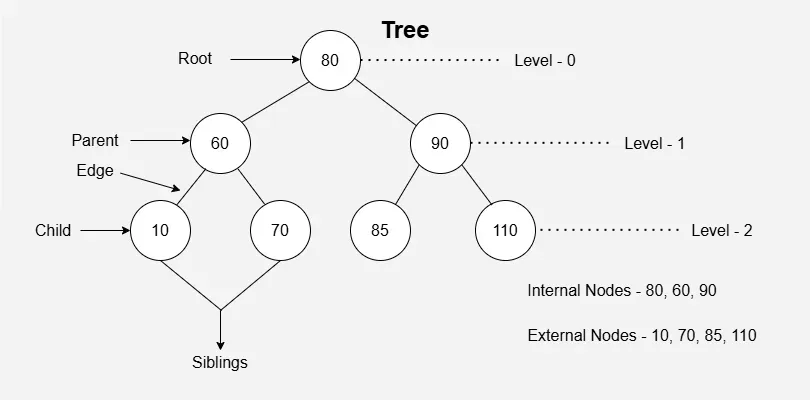

# 📘 Tree Data Structures

---

## 🌳 1. What is a Tree?

- A **Tree** is a **hierarchical data structure**.
- It is made of **nodes** connected by **edges**.
- Think of it like a **family tree** or **file explorer** (folders inside folders).

---

## 🧩 2. Terminology

- **Node** → Each element in a tree.
- **Root** → The topmost node of the tree.
- **Parent** → A node that has child nodes.
- **Child** → A node that comes from a parent.
- **Leaf** → A node with no children.
- **Siblings** → Nodes having the same parent.
- **Height of Tree** → Longest path from root to leaf.
- **Depth of Node** → Distance from root to that node.



Example:

```
        A (root)
       / \
      B   C
     / \
    D   E
```

- A → root
- B, C → children of A
- D, E → children of B
- D, E, C → leaf nodes

---

## 🌲 3. Types of Trees

### 🔹 Binary Tree

- Each node has **at most 2 children** → `Left` and `Right`.

### 🔹 Binary Search Tree (BST)

- A special Binary Tree.
- Rule:

  - Left child < Parent
  - Right child > Parent

### 🔹 AVL Tree

- A **self-balancing BST**.
- Keeps tree height balanced for **fast searching**.

### 🔹 Red-Black Tree

- Another type of **balanced BST**.
- Used in **libraries, OS, databases** for efficient searching.

---

## 🏗️ 4. Tree Representation in C

### 🔹 Using Structures (Linked Representation)

```c
#include <stdio.h>
#include <stdlib.h>

struct Node {
    int data;
    struct Node* left;
    struct Node* right;
};

// Create a new node
struct Node* createNode(int value) {
    struct Node* newNode = (struct Node*)malloc(sizeof(struct Node));
    newNode->data = value;
    newNode->left = newNode->right = NULL;
    return newNode;
}
```

### 🔹 Using Arrays (For Complete Binary Trees Only)

- Store nodes in an array like heap.
- Example:

```
Index:   0   1   2   3   4   5
Value:   A   B   C   D   E   F
```

- Parent at `i`, Left Child at `2*i+1`, Right Child at `2*i+2`.

---

## 🔄 5. Tree Traversals

Traversal means visiting all nodes.

1. **Inorder (Left → Root → Right)**

   - Example BST: Output → Sorted order

2. **Preorder (Root → Left → Right)**

   - Used in copying trees

3. **Postorder (Left → Right → Root)**

   - Used in deleting trees

### C Implementation of Traversals

```c
void inorder(struct Node* root) {
    if (root != NULL) {
        inorder(root->left);
        printf("%d ", root->data);
        inorder(root->right);
    }
}

void preorder(struct Node* root) {
    if (root != NULL) {
        printf("%d ", root->data);
        preorder(root->left);
        preorder(root->right);
    }
}

void postorder(struct Node* root) {
    if (root != NULL) {
        postorder(root->left);
        postorder(root->right);
        printf("%d ", root->data);
    }
}
```

---

## ⚙️ 6. Operations on BST

### 🔹 Insertion

```c
struct Node* insert(struct Node* root, int value) {
    if (root == NULL) return createNode(value);
    if (value < root->data) root->left = insert(root->left, value);
    else if (value > root->data) root->right = insert(root->right, value);
    return root;
}
```

### 🔹 Searching

```c
struct Node* search(struct Node* root, int key) {
    if (root == NULL || root->data == key) return root;
    if (key < root->data) return search(root->left, key);
    return search(root->right, key);
}
```

### 🔹 Deletion (3 Cases)

1. Node is a leaf → Delete directly.
2. Node has one child → Replace with child.
3. Node has two children → Replace with **inorder successor**.

---

## 📑 7. Applications of Trees

- **Expression Trees** → Used to evaluate math expressions.
- **Databases** → Indexing with B-trees.
- **File Systems** → Directory structures.
- **Networking** → Routing algorithms.
- **AI/ML** → Decision Trees.

---

## 🎯 8. Quick Comparison

| Type of Tree | Special Property              | Use Case               |
| ------------ | ----------------------------- | ---------------------- |
| Binary Tree  | Max 2 children                | General representation |
| BST          | Ordered left < root < right   | Searching & sorting    |
| AVL Tree     | Balanced BST                  | Faster searching       |
| Red-Black    | Balanced BST with color rules | OS, Databases          |

---
